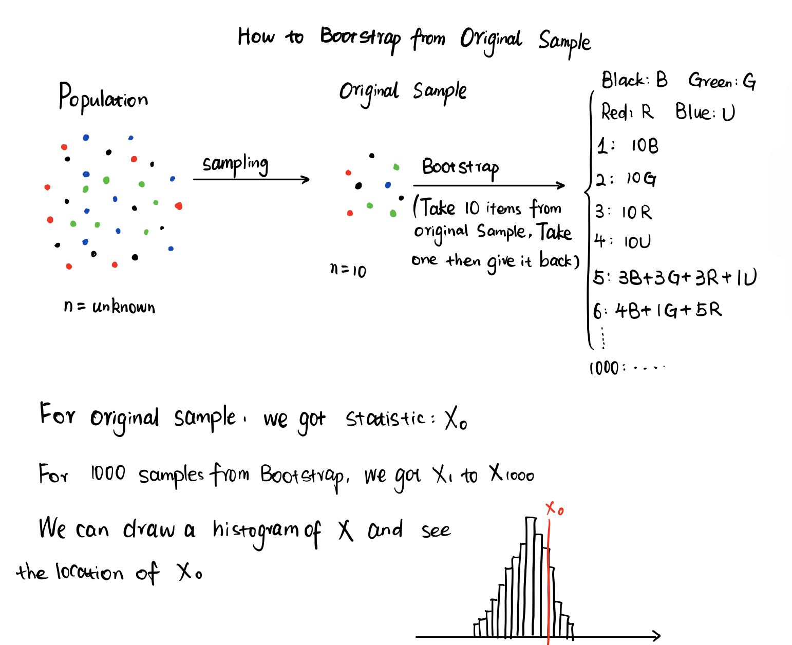
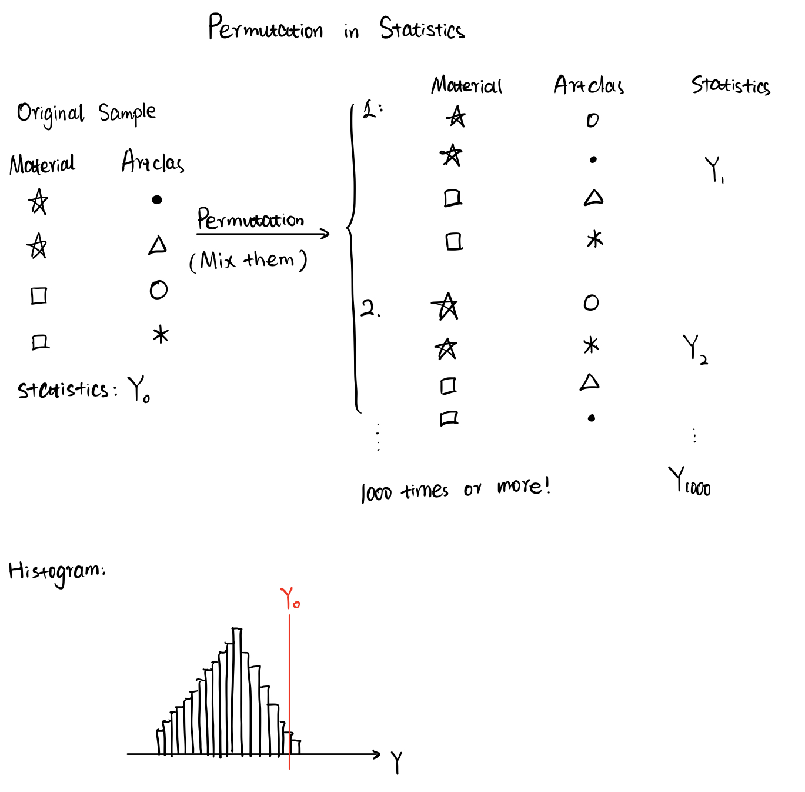

# My Comprehension on Bootstrap and Permutation

---
title: "Bootstrap&Permutation"
author: "Marvin Wu"
date: "2023-11-23"
output: html_document
---

```{r setup, include=FALSE}
knitr::opts_chunk$set(echo = TRUE)
```

## Hypothesis Testing

A common workflow in statistics includes:

1.  Defind the Population

2.  Give null hypothesis(*H*${0}$): hypothesis we want to reject

3.  Give alternative hypothesis(*H*${1}$): the opposite hypothesis of *H*${0}$

4.  Collect samples

5.  Do statistical tests on the sample data: chi-square, t-test, ANOVA, etc

6.  Draw conclusion: reject *H*${0}$ or not reject it

## Parametric Testing

The distribution of Population is known to us. Normal, Poisson, or Binormal distribution.

Thus, the mu, sigma, standard deviation of Population is clear.

## Non-parametric Testing

We don't know the distribution of Population.

### Bootstrap: Resampling with duplicates

Use this method when we don't know the distribution.

Principle: Original sample is treated as new population, we resample from the new population with replacement(放回, take out one and give it back to population).




### Permutation:

Use this method when we don't know the distribution.

Principle: Mix the data of columns we want to analyse first. Permute(排列) them to generate a new sample.


